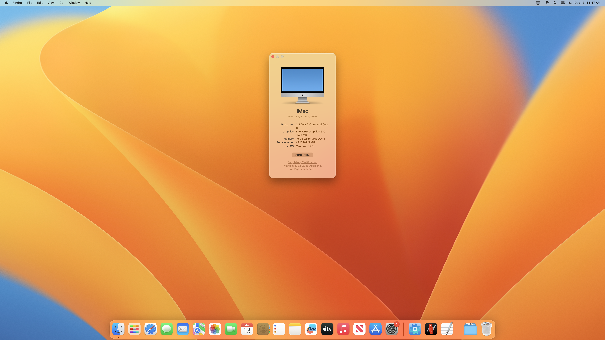

# Dell Optiplex 3080 MFF EFI - macOS Ventura

Dell Optiplex 3080 Micro Form Factor OpenCore EFI build for macOS Ventura v13.7.8.

## Screenshot

<figure>

<figcaption>Screenshot of the macOS Ventura Desktop.</figcaption>
</figure>

## Specification

| Device       | Model                               | Status |
| ------------ | ----------------------------------- | ------ |
| CPU          | Intel Core i5-10500T                | Works  |
| GPU          | Intel UHD Graphics 630              | Works  |
| Memory       | Crucial 16GB DDR4 2666 MHz          | Works  |
| Drive        | Samsung PM991a NVMe 512GB           | Works  |
| Audio        | Realtek ALC3246                     | Works  |
| WiFi & BT    | Intel Wireless-AC 8265NGW           | Works  |
| Ethernet     | Realtek RTL8111 GbE Controller      | Works  |
| Speaker      | Internal                            | Works  |
